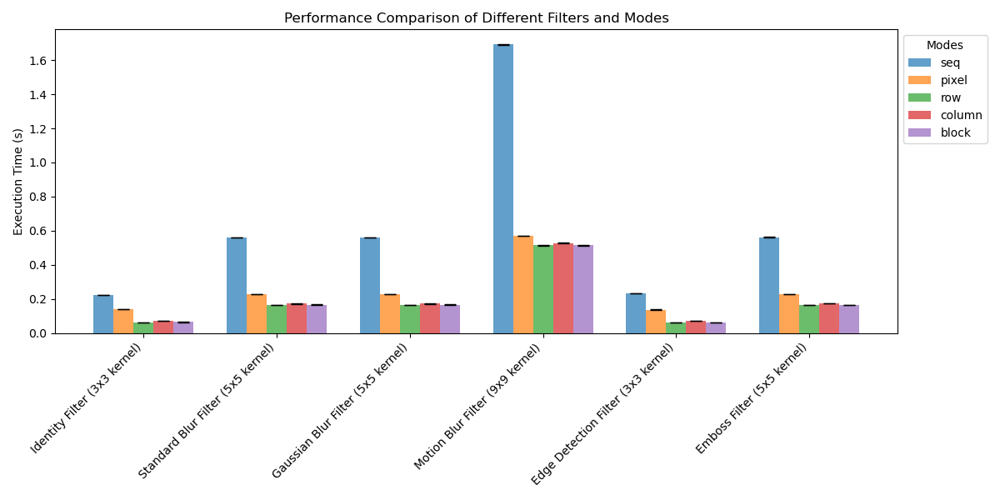

# Анализ производительности

## Введение

В рамках данного анализа исследуется эффективность различных подходов к параллельной обработке изображений с использованием фильтров свертки. Тестирование проводилось на двух изображениях с разными разрешениями: **1920x1080** ([cat.bmp](images/cat.bmp)) и **2400x1590** ([monkey.bmp](images/monkey.bmp)).

## Конфигурация системы:

 - **Процессор:** Процессор: Intel Core i7-11370H (4 физических ядра, 8 логических потоков) с фиксированной частотой 3.3 GHz (`sudo cpupower frequency-set --min 3300MHz --max 3300MHz`);
   - **Кэш L1:** 80 КБ на ядро (48 КБ – кэш данных, 32 КБ – кэш инструкций);
   - **Кэш L2:** 1.25 МБ на ядро;
   - **Общий кэш L3:** 12 МБ.

 - **ОЗУ:** 16ГБ

 - **ОС:** Linux Kubuntu 24.04

 - **Настройки производительности:** Использовался режим `performance` (`sudo cpupower frequency-set -g performance`) для минимизации влияния динамического изменения частоты процессора.

 Для обеспечения чистоты эксперимента система перезагружалась после каждого тестирования, а сторонние процессы были минимизированы.

## Параметры запуска программы

Были протестированы следующие стратегии разделения работы:

1. **Последовательная реализация (`seq`)** - базовый вариант без параллелизации;
2. **Попиксельная обработка (`pixel`)** - каждый поток обрабатывает отдельные пиксели;
3. **Построчная обработка (`row`)** - изображение делится на горизонтальные полосы;
4. **Постолбцовая обработка (`column`)** - изображение делится на вертикальные полосы;
5. **Блочная обработка (`block`)** - изображение делится на прямоугольные блоки.

Протестированы все доступные фильтры из списка [доступных фильтров](README.md#available-filters) (кроме `fbl`):

 - Identity Filter (3x3 kernel),
 - Standard Blur Filter (5x5 kernel),
 - Gaussian Blur Filter (5x5 kernel),
 - Motion Blur Filter (9x9 kernel),
 - Edge Detection Filter (3x3 kernel),
 - Emboss Filter (5x5 kernel).

**Количество потоков:** 4 (фиксированно для всех тестов).

**Количество прогонов для каждого теста:** 40 (обеспечивает статистическую достоверность результатов).

**Код бенчмарков**:
 - Сравнение времени выполнения для разных фильтров и режимов: [`tests/benchmarks/comparison_of_times.py`](tests/benchmarks/comparison_of_times.py);
 - Сравнение использования кэша - [`tests/benchmarks/comparison_using_perf.py`](tests/benchmarks/comparison_using_perf.py).

Анализ использования кэша проводился с использованием утилиты `perf` на примере фильтра `id` (чтобы исключить влияние сложности вычислений и сосредоточиться исключительно на зависимости от способов разделения обработки изображения). Оценивались следующие метрики:
1) `cache-references`: Общее количество обращений к кэшу;
2) `cache-misses`: Количество пропусков кэша на всех уровнях;
3) `L1-dcache-load-misses`: Количество пропусков первого уровня кэша данных (L1).

## Результаты тестирования

### **1. Для [1920x1080](images/cat.bmp):**

#### Сравнительный график всех фильтров:

#### Использование кэша:

| Mode    | % Cache-misses | L1-dcache-load-misses |
|---------|----------------|-----------------------|
| `seq`   | 12%            | 27 242 281            |
| `pixel` | 3%             | 12 691 073            |
| `row`   | 44%            | 1 793 849             |
| `column`| 5%             | 27 258 502            |
| `block` | 41%            | 1 666 778             |

### **2. Для [2400x1590](images/monkey.bmp):**

#### Сравнительный график всех фильтров:

#### Использование кэша:

| Mode    | % Cache-misses | L1-dcache-load-misses |
|---------|----------------|-----------------------|
| `seq`   | 8%             | 45 977 692            |
| `pixel` | 4%             | 24 522 502            |
| `row`   | 49%            | 3 264 117             |
| `column`| 4%             | 43 579 885            |
| `block` | 47%            | 2 972 328             |

Более детальные графики для каждого фильтра и числовые результаты доступны в директориях [`tests/plots/<image resolution>`](tests/plots/).

## Анализ результатов

**1. Последовательная обработка (`seq`):**
 - Производительность:
   - Для всех фильтров последовательная обработка демонстрирует наибольшее время выполнения по сравнению с параллельными методами, что объясняется отсутствием параллелизма.
 - Использование кэша:
   - Количество обращений к кэшу (`cache-references`) минимально для изображения 1920x1080, так как данные полностью или частично помещаются в кэш. Однако для изображения 2400x1590 значение `cache-references` становится максимальным, так как больший объем данных приводит к частому вытеснению данных из кэша;
   - Значение `cache-misses` максимально среди всех обработок, что связано с тем, что однопоточная обработка приводит к интенсивному использованию кэша одним потоком. Это увеличивает вероятность промахов при работе с большими объемами данных, которые не помещаются в кэш целиком. (В то время как параллельные методы разбивают данные на блоки, которые лучше помещаются в кэш);
   - Высокое количество L1 промахов (27/46 млн) объясняется тем, что данные загружаются в кэш однократно и не используются повторно.

**2. Попиксельная обработка (`pixel`):**
 - Производительность:
   - Время выполнения значительно лучше, чем у последовательной обработки;
   - При увеличении размера изображения до 2400x1590 время выполнения также увеличивается, но менее эффективно, чем у других параллельных методов. Это связано с высокой степенью конкуренции за доступ к памяти между потоками;
   - По сравнению с другими параллельными методами необходима более частая синхронизация общиих данных (`atomic_int *next_block`). То есть существует высокая конкуренция за общий счетчик `next_block`, что создает узкое место пропускной способности.

 - Использование кэша:
   - Количество обращений к кэшу (`cache-references`) значительно выше, чем у последовательной обработки, особенно для изображения 2400x1590. Это объясняется тем, что каждый поток работает с отдельными пикселями, что приводит к хаотичному доступу к данным и снижению эффективности использования кэша;
   - Значение `cache-misses` ниже, чем у последовательной обработки, но схожее с `row` и `block`. Это связано с тем, что попиксельная обработка приводит к более частым промахам из-за неупорядоченного доступа к данным.

**3. Построчная обработка (`row`):**
 - Производительность:
   - Метод `row` демонстрирует один из лучших показателей производительности среди всех методов.
 - Использование кэша:
   - Количество обращений к кэшу (`cache-references`) значительно ниже, чем у методов `pixel` и `column`. Это связано с тем, что данные обрабатываются по строкам, что обеспечивает более последовательный доступ к памяти;
   - Промахи в обращении к кэшу минимальны среди всех методов: значение `cache-misses` схоже со значениями `pixel` и `block`, однако количество L1 промахов минимально - что указывает на высокую эффективность использования кэша. Это связано с тем, что данные обрабатываются по строкам, что обеспечивает высокую локальность доступа;
   - Интересно, что мeтоды `row` и `block` обладают относительно других методов высоким процентом `cache-misses` (`cache-misses / cache-references * 100`), однако абсолютные значения промахов остаются низкими. Это объясняется малым количеством обращений к кэшу из-за более компактной организацией данных и более последовательным доступом к памяти, чем у остальных методов. Таким образом, высокий процент промахов является скорее артефактом, чем признаком неэффективности.

**4. Постолбцовая обработка (`column`):**
 - Производительность:
   - Производительность метода `column` немного уступает методу `row`, но остается выше, чем у методов `pixel` и `seq`;
   - При увеличении размера изображения до 2400x1590 разрыв в производительности между методами `row` и `column` увеличивается.
 - Использование кэша:
   - Количество обращений к кэшу (`cache-references`) для 2400x1590 значительно выше, чем у метода `row`. Это связано с тем, что постолбцовый доступ к данным менее эффективен для процессоров, которые оптимизированы для работы с данными, расположенными последовательно в памяти;
   - При этом L1 промахи сопоставимы с `seq` из-за частых переходов между строками и нарушения пространственной локальности (переход к следующей строке означает переход на `width * sizeof(double)` байт, что почти всегда превышает размер кэш-линии - 64 байта).

**5. Блочная обработка (`block`):**
 - Производительность:
   - Производительность метода `block` сопоставима с методом `row`.
 - Использование кэша:
   - Значения `cache-references`, `cache-misses` и `L1-dcache-load-misses` сопоставимы с методом `row`. Это связано с тем, что блочная обработка также обеспечивает последовательный доступ к данным, что минимизирует количество промахов.

### Общие выводы
 - Зависимость эффективности от размера ядра фильтра :
   - Эффективность параллелизации снижается с увеличением размера ядра фильтра из-за роста вычислительной сложности операций свертки. Это связано с тем, что вложенные циклы по filterX и filterY выполняют `O(k^2)` операций для каждого пикселя, где k - размер ядра фильтра.
 - Влияние архитектуры памяти:
   - Производительность напрямую зависит от эффективности использования кэш-памяти. Методы с хаотичным доступом к данным (например, `pixel` и `column`) значительно уступают методам с более последовательным доступом (`row`, `block`) из-за высоких значений `cache-misses` и `L1-dcache-load-misses`;
   - Увеличение разрешения изображения приводит к росту количества обращений к памяти, что усиливает важность оптимизации доступа к данным.
